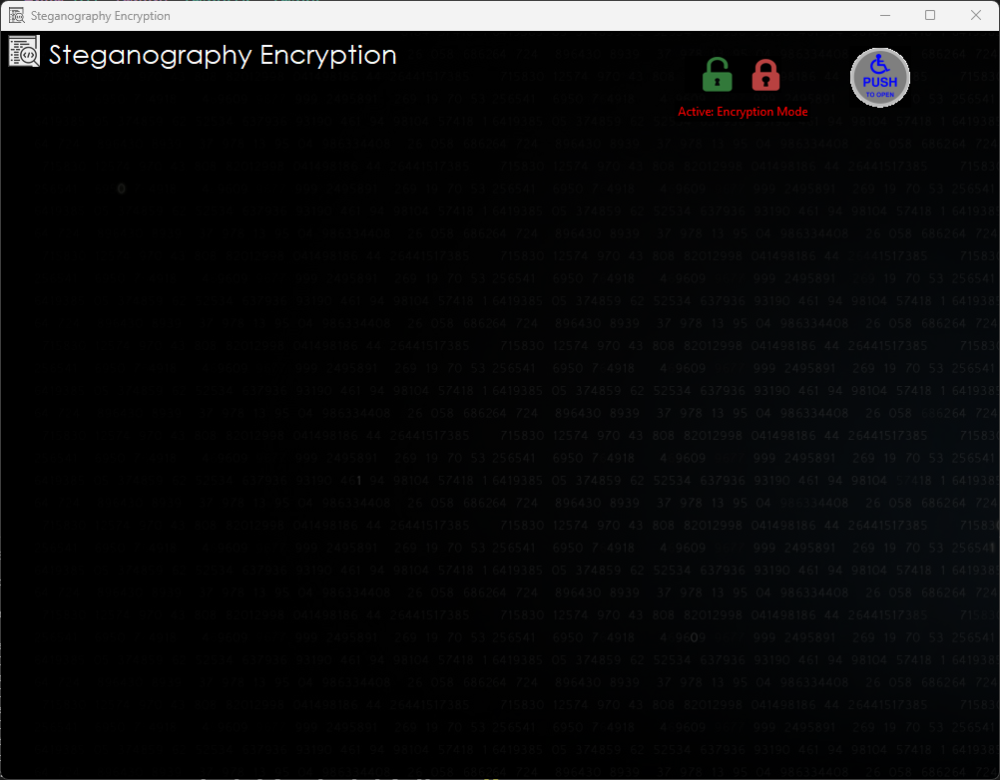
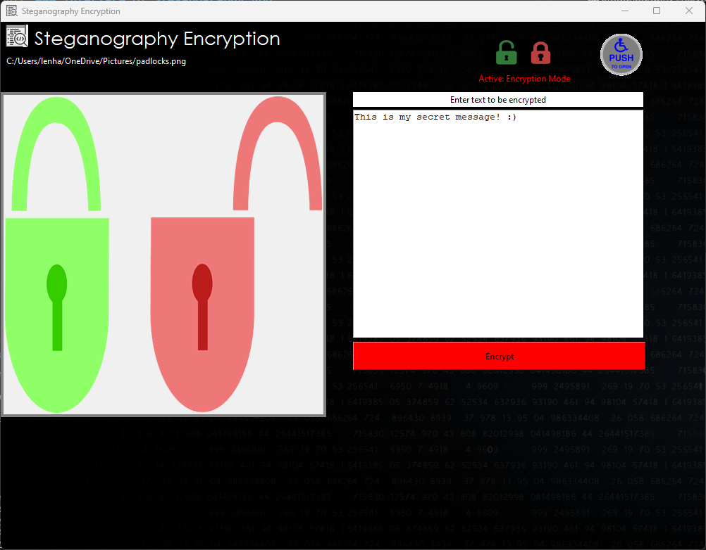
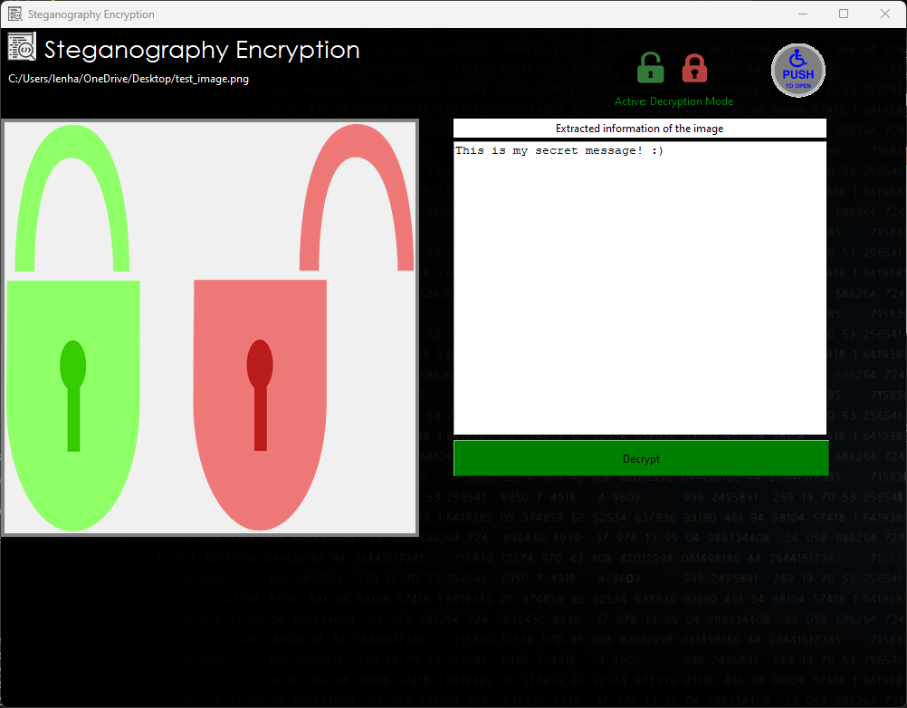

# Steganography App

Steganography App can encrypt a piece of information into a high resolution image without distorting it.

## Installation

Make sure **Python** and **pip** are installed on your system.

To install **Python**, use this [link](https://www.python.org/downloads/).

Check **Python** version using

```
python --version
```

Installing **pip** using Python

```
python -m ensurepip --upgrade
```

Check **pip** version using

```
pip -V
```

Installing **tkinter**

```
pip install tk
```

## Execution

Make sure that you are currently in the `src` directory.\
Use the following command

```
python main.py
```

or

```
py main.py
```

## How to Use Steganography App?



Click on the **Push** icon to open and image. There will be a text box for you to enter in information you want to hide inside the image. Once done, click on **Encrypt** and save as a new file.



To decrypt the image, click on the **green lock** icon and select the recently encrypted image. Finally, click on **Decrypt** to extract the information on the encrypted image.



## Future Improvements

- Add threadings to prevent app from crashing when encrypting long strings.
- Add more alerts when problems occur (no more command line interface error)
- Redesign app's layout + better name
- Target 2nd, 3rd, 4th, etc. least significant bit
- Support more files instead of only .png
